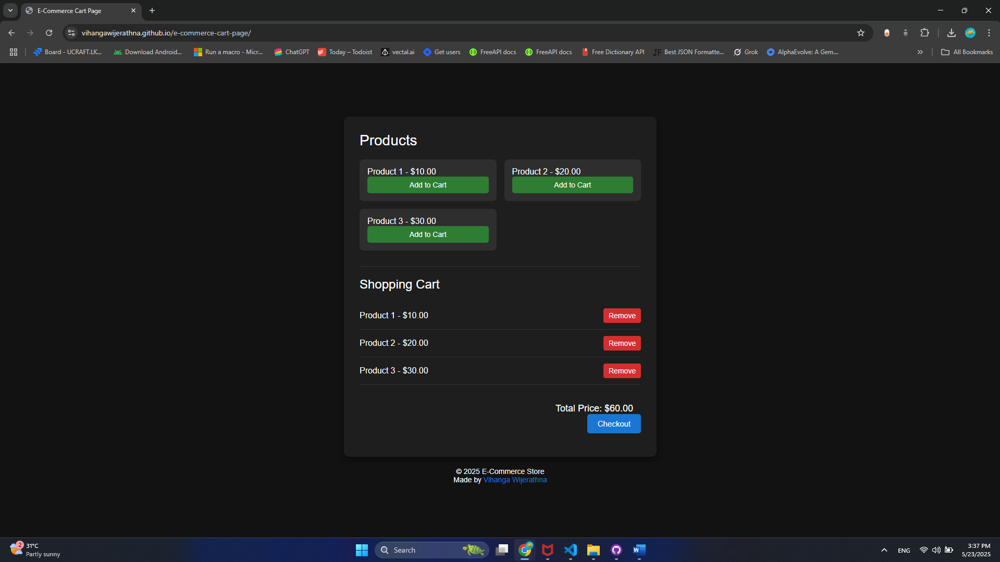

# E-Commerce Cart Page

A simple e-commerce shopping cart implementation with product listing and cart management functionality.

## Features

- Product listing with add to cart functionality
- Shopping cart with real-time updates
- Local storage to persist cart data between sessions
- Remove items from cart
- Checkout functionality
- Responsive design with dark mode UI

## Live Demo

[View the live demo](https://vihangawijerathna.github.io/e-commerce-cart-page/)

## Screenshots



## Technologies Used

- HTML5
- CSS3
- JavaScript (Vanilla)
- Local Storage API

## Installation

1. Clone the repository:

   ```bash
   git clone https://github.com/vihangawijerathna/e-commerce-cart-page.git
   ```

2. Navigate to the project directory:

   ```bash
   cd e-commerce-cart-page
   ```

3. Open the `index.html` file in your browser or use a local development server.

## Usage

- Browse the product listings on the main page
- Click "Add to Cart" to add products to your shopping cart
- View your cart items below the product listings
- Adjust quantities or remove items as needed
- Click "Checkout" to complete your purchase

## Project Structure

```
e-commerce-cart-page/
├── index.html          # Main HTML file
├── styles.css          # CSS styling
├── script.js           # JavaScript functionality
├── screenshot.png      # Screenshot of the application
└── README.md           # Project documentation
```

## How It Works

The application uses vanilla JavaScript to handle the cart functionality. Products are dynamically added to the DOM, and the cart state is stored in the browser's local storage to persist between sessions.

The main functions include:

- Adding products to the cart
- Removing products from the cart
- Calculating the total price
- Saving the cart to local storage
- Rendering the cart UI

## Future Enhancements

- Fetch products using the FakeStore API
- Add quantity controls for cart items

## License

This project is licensed under the MIT License - see the LICENSE file for details.

## Contact

Vihanga Wijerathna - [GitHub](https://github.com/vihangawijerathna)

Project Link: https://github.com/vihangawijerathna/e-commerce-cart-page
